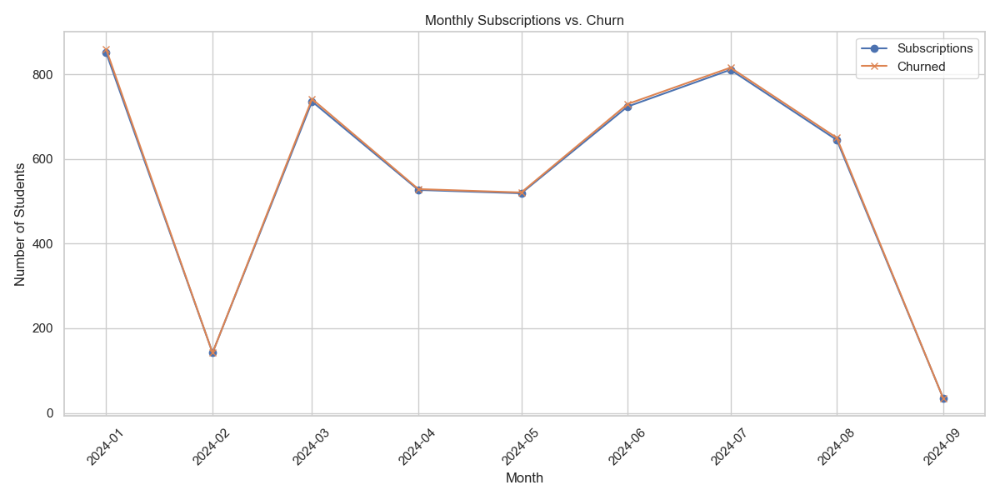
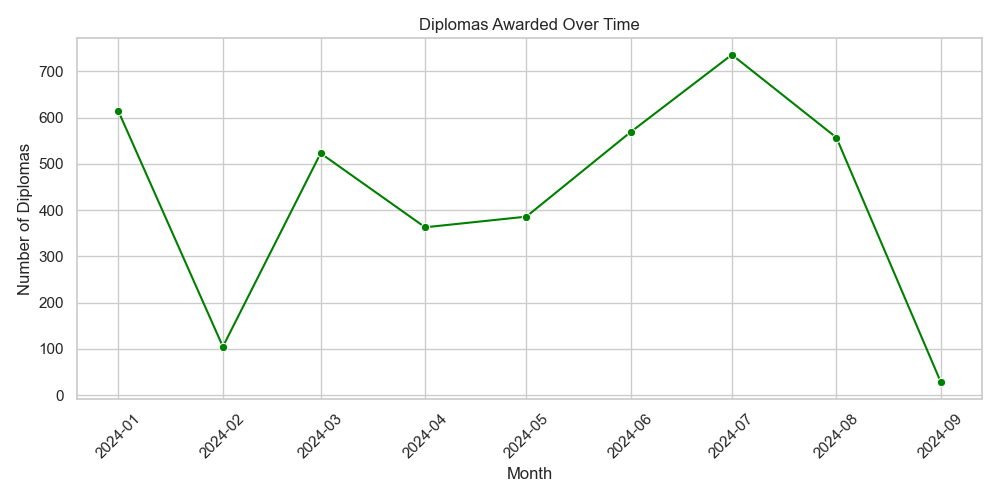
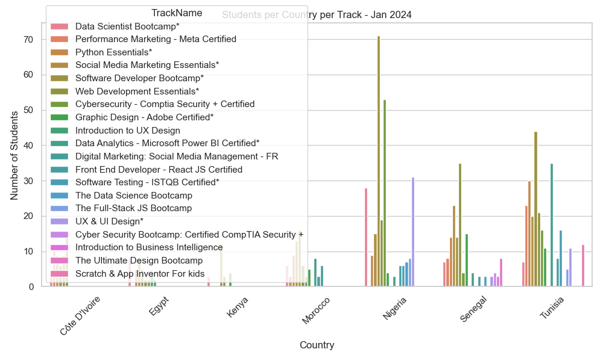
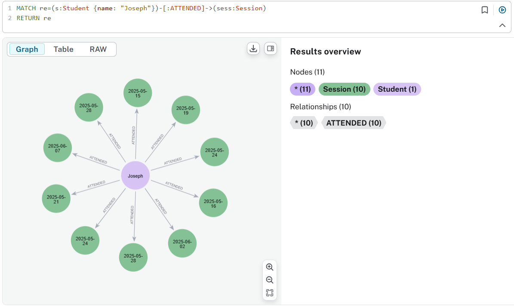
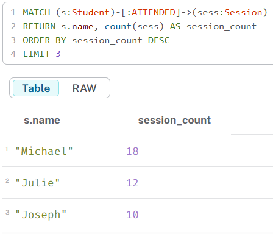
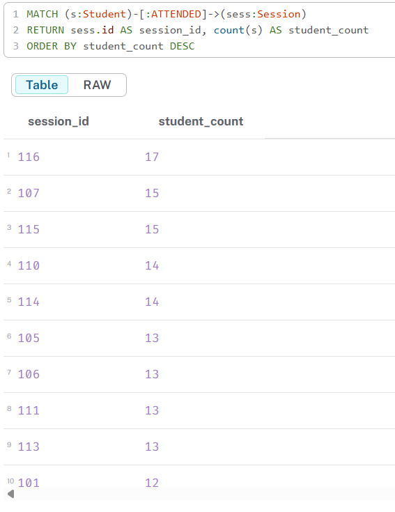
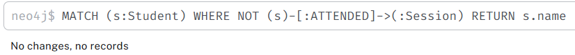
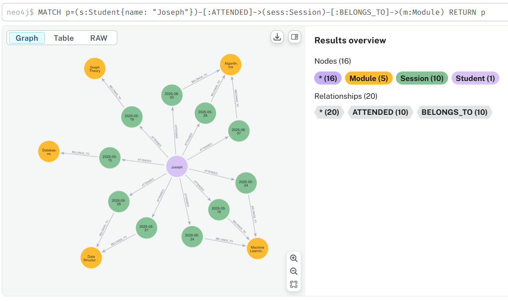

# 📦 DataOps Task – GoMyCode

## 🔍 Overview

This repository demonstrates the full data engineering workflow for the GoMyCode DataOps Internship Task, including:

- 📊 ETL pipeline (OLTP → OLAP) for student subscription analytics
- 🔗 Graph data modeling & Cypher queries in Neo4j Aura
- 🗄️ Relational schema & SQL queries (PostgreSQL-compatible)
- 📈 Visual analytics using Looker Studio and MATLAB
- 🧾 Structured documentation, markdown reports, and a clean GitHub repo

---

## 1. 🧪 OLTP → OLAP Pipeline & Dashboard

**Goal:** Transform raw student subscription data into actionable analytics for business decisions.

**Process:**
- Extract raw data from `data/Subscription.csv`
- Transform & clean data (date formats, nulls, booleans)
- Build monthly and cohort-based OLAP datasets
- Load results into CSV (or PostgreSQL)
- Visualize metrics using:
  - 📊 Looker Studio (geo, cohort, diploma trends)
  - 📈 MATLAB (churn, subscriptions, cohort charts)

**ETL Script:** [`etl/etl_task.py`](etl/etl_task.py)  
**Visualization Script:** [`dashboard/visualization.py`](dashboard/visualization.py)  
**Outputs:**
- `data/cleaned_olap_dataset.csv` (OLAP-ready)
- `data/cohort_analysis.csv` (cohort metrics)
- `data/monthly_metrics.csv`, `data/diploma_stats.csv`

**Sample Visualizations:**
| Metric                         | Chart Example                                                    |
| ------------------------------ | ---------------------------------------------------------------- |
| Monthly Subscriptions vs Churn |    |
| Diplomas Over Time             |                      |
| Students by Country & Track    |         |

**PDF Report:** [`dashboard/Student_Report.pdf`](dashboard/Student_Report.pdf)

---

## 2. 🔗 Graph Modeling with Neo4j Aura

**Schema:**
- 🧑‍🎓 Student
- 🗓️ Session
- 🧑‍🏫 Instructor
- 📘 Module

**Relationships:**
- Student —[:ATTENDED]→ Session
- Session —[:TAUGHT_BY]→ Instructor
- Session —[:BELONGS_TO]→ Module

**Graph Schema Markdown:** [`graph/graph_schema.md`](graph/graph_schema.md)  
**Schema Diagram:** 

**Cypher Load Script:** [`graph/cypher_load_and_modeling.txt`](graph/cypher_load_and_modeling.txt)

**Cypher Queries:**
- Q1: Sessions attended by Joseph
- Q2: Top 3 students by attendance
- Q3: Attendance per session
- Q4: Unique students per module
- Q5: Students with zero attendance
- Q6: Joseph's attendance path

**Full queries:** [`graph/cypher_queries.txt`](graph/cypher_queries.txt)  
**Markdown with results:** [`docs/cypher_queries_output.md`](docs/cypher_queries_output.md)

**Query Visuals:**
| Query | Screenshot |
|-------|------------|
| Q1: Sessions attended by Joseph |  |
| Q2: Top 3 students by attendance |  |
| Q3: Attendance per session |  |
| Q4: Unique students per module |  |
| Q5: Students with zero attendance |  |
| Q6: Joseph's attendance path |  |

---

## 3. 🗃️ Relational Schema & SQL Queries

**Class diagram:** 


**Tables:** students, sessions, modules, attendance, intructors

**SQL Queries:** [`graph/sql_queries.sql`](graph/sql_queries.sql)  
**Markdown with explanations:** [`docs/sql_queries.md`](docs/sql_queries.md)

- All Cypher queries were translated into SQL (PostgreSQL-compatible)

---

## 4. 📚 Documentation & Design Notes

| Area             | Details                                                               |
| ---------------- | --------------------------------------------------------------------- |
| Pipeline Purpose | Build clean OLAP datasets for churn, revenue, and cohort tracking     |
| Graph Design     | Flexible and expressive using property graph modeling (see node/relationship types in `graph/graph_schema.md` and images) |
| Query Purpose    | Solve real business questions (engagement, retention, learning paths) |
| Tools Used       | Neo4j Aura, Python (Pandas), PostgreSQL, Looker Studio, MATLAB        |
| Assumptions      | Clean student IDs, normalized dates, sessions tied to one module      |
| Challenges       | Handling date parsing, graph ↔ SQL mapping, foreign key consistency   |

---

## 5. 📁 Repository Structure

```bash
├── etl/                  # Python ETL script
│   └── etl_task.py
├── data/                 # Raw + transformed datasets
├── dashboard/            # Chart images, Looker/MATLAB charts, PDF report, scripts
│   ├── visualization.py
│   └── Student_Report.pdf
├── docs/                 # Markdown files for queries/schema/results
│   ├── cypher_queries_output.md
│   └── sql_queries.md
├── graph/                # Cypher, SQL, schema, and load scripts
│   ├── cypher_load_and_modeling.txt
│   ├── cypher_queries.txt
│   ├── graph_schema.md
│   └── sql_queries.sql
├── images/               # ERD, graph schema, query screenshots
└── README.md             # This file
```

---

## 6. 🚀 How to Run

1. Run the ETL pipeline:
   ```bash
   python etl/etl_task.py
   ```
2. Check cleaned outputs in:
   - `data/cleaned_olap_dataset.csv`
   - `data/cohort_analysis.csv`
   - `data/monthly_metrics.csv`
   - `data/diploma_stats.csv`
3. View dashboards, visuals, and PDF report in `dashboard/` and `images/`
4. Open Cypher queries in Neo4j Aura:
   - Load graph via `graph/cypher_load_and_modeling.txt`
   - Run queries from `graph/cypher_queries.txt`
5. Explore Looker Studio Dashboard:
   - [Looker Studio Dashboard Link](https://lookerstudio.google.com/s/kTDNsXjy3Ew)
   - 🧾PDF available in `dashboard/`
6. Review markdown documentation in `docs/`

---

## 🙋‍♀️ Created By

> Developed by ***Ahlem Ben Mohamed***  
> GitHub: [Ahlem_Github_link](https://github.com/AhlemBenmed)
> Linkedin: [Ahlem_Linkedin_link](www.linkedin.com/in/ahlem-benmed)
---
**For more details, see the respective files and diagrams in each folder.**
