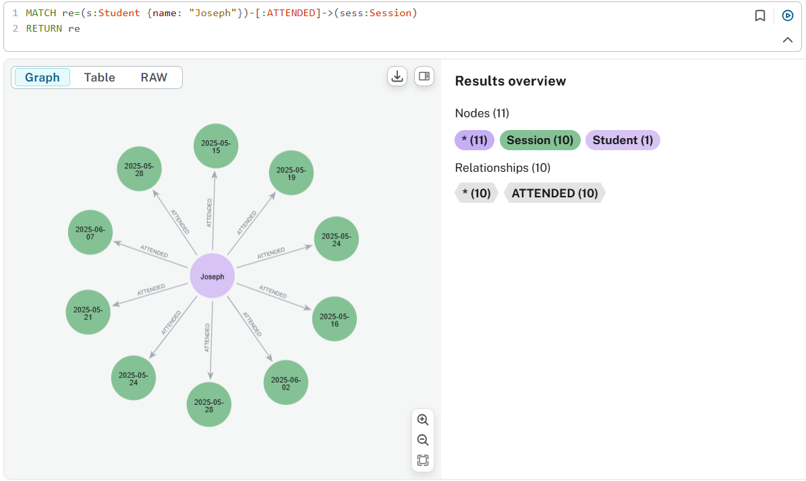
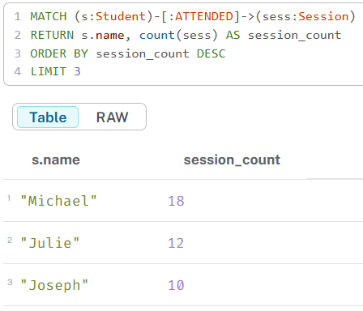
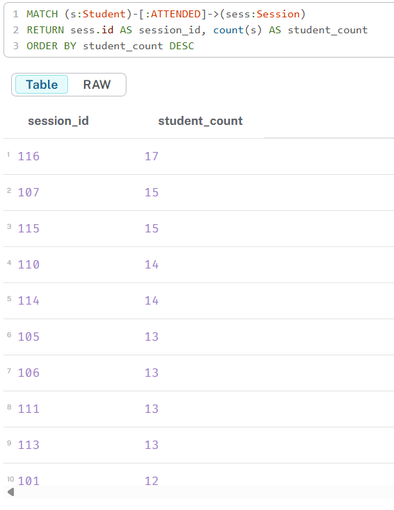
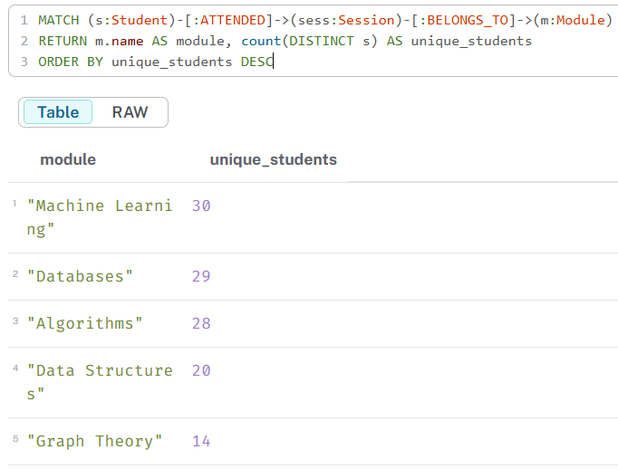

# 📊 Cypher Queries & Results

This file contains the key Cypher queries used to explore the Neo4j graph for Task 2, along with screenshots of their results.

> ℹ️ Note: The student name "Alice" was not found in the dataset. Therefore, queries referencing "Alice" were adjusted to use "Joseph", who is present in the student records.

---

## ✅ Q1: Sessions Attended by Joseph

```cypher
MATCH re=(s:Student {name: "Joseph"})-[:ATTENDED]->(sess:Session)
RETURN re
```

This query shows which sessions the student Joseph attended.

🖼️ Screenshot:


---

## ✅ Q2: Top 3 Most Active Students

```cypher
MATCH (s:Student)-[:ATTENDED]->(sess:Session)
RETURN s.name, count(sess) AS session_count
ORDER BY session_count DESC
LIMIT 3
```

Returns the top 3 students based on number of attended sessions.

🖼️ Screenshot:


---

## ✅ Q3: Attendee Count per Session

```cypher
MATCH (s:Student)-[:ATTENDED]->(sess:Session)
RETURN sess.id AS session_id, count(s) AS student_count 
ORDER BY student_count DESC
```

Counts how many students attended each session.

🖼️ Screenshot:


---

## ✅ Q4: Unique Students per Module

```cypher
MATCH (s:Student)-[:ATTENDED]->(sess:Session)-[:BELONGS_TO]->(m:Module)
RETURN m.name AS module, count(DISTINCT s) AS unique_students
ORDER BY unique_students DESC
```

Returns the number of unique students per module.

🖼️ Screenshot:


---

## ✅ Q5: Students with Zero Attendance

```cypher
MATCH (s:Student)
WHERE NOT (s)-[:ATTENDED]->(:Session)
RETURN s.name
```

Lists students who never attended any session.

🖼️ Screenshot:


---

## ✅ Q6: Modules and Sessions Attended by Joseph

```cypher
MATCH p=(s:Student{name: "Joseph"})-[:ATTENDED]->(sess:Session)-[:BELONGS_TO]->(m:Module)
RETURN p
```

Returns a visual path from Joseph to sessions and modules attended.

🖼️ Screenshot:


---

## 📌 Notes

- All queries were tested using Neo4j Aura.
- The graph model follows the schema:  
  `(:Student)-[:ATTENDED]->(:Session)-[:BELONGS_TO]->(:Module)`  
  and  
  `(:Session)-[:TAUGHT_BY]->(:Instructor)`

