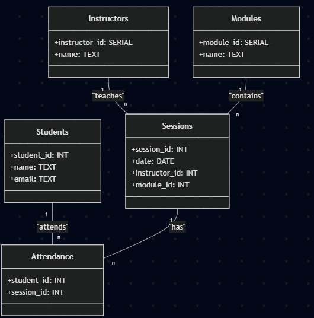

# 🗃️ SQL Queries (Graph-to-SQL Conversion)

This file contains SQL (PostgreSQL-compatible) equivalents of the Cypher queries used in Task 2.

---

## 🔁 Schema Diagram

Relational schema equivalent to the Neo4j graph (UML):



---

## ✅ SQL Queries

### Q1: Sessions attended by Alice

```sql
SELECT s.*
FROM sessions s
JOIN attendance a ON s.id = a.session_id
JOIN students st ON a.student_id = st.id
WHERE st.name = 'Alice';
```

---

### Q2: Top 3 Most Active Students

```sql
SELECT st.name, COUNT(*) AS session_count
FROM attendance a
JOIN students st ON a.student_id = st.id
GROUP BY st.name
ORDER BY session_count DESC
LIMIT 3;
```

---

### Q3: Attendee Count per Session

```sql
SELECT s.id AS session_id, COUNT(DISTINCT a.student_id) AS student_count
FROM sessions s
LEFT JOIN attendance a ON s.id = a.session_id
GROUP BY s.id
ORDER BY student_count DESC;
```

---

### Q4: Unique Students per Module

```sql
SELECT m.name AS module, COUNT(DISTINCT a.student_id) AS unique_students
FROM attendance a
JOIN sessions s ON a.session_id = s.id
JOIN modules m ON s.module_id = m.id
GROUP BY m.name
ORDER BY unique_students DESC;
```

---

### Q5: Students with Zero Attendance

```sql
SELECT st.name
FROM students st
LEFT JOIN attendance a ON st.id = a.student_id
WHERE a.session_id IS NULL;
```

---

### Q6: Modules and Sessions Attended by Alice

```sql
SELECT m.name AS module, s.id AS session_id
FROM students st
JOIN attendance a ON st.id = a.student_id
JOIN sessions s ON a.session_id = s.id
JOIN modules m ON s.module_id = m.id
WHERE st.name = 'Alice';
```

---

