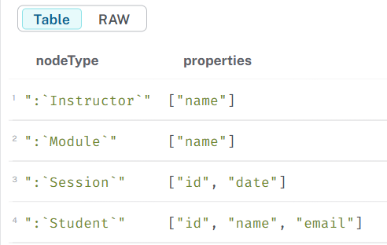
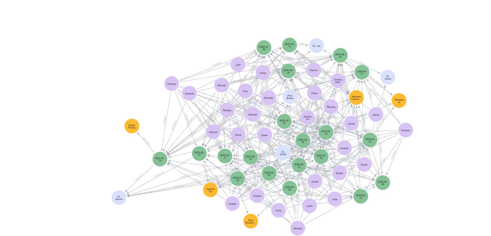
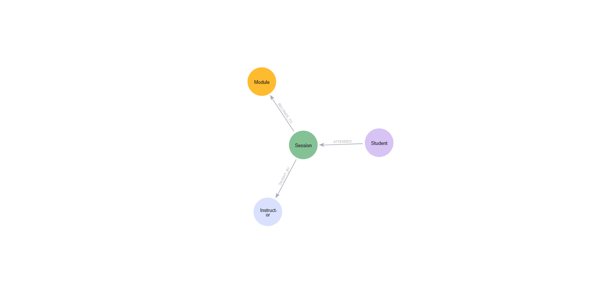

# 📘 Graph Schema Design (Neo4j Aura)

This document summarizes the structure of the Neo4j graph database used in Task 2.

---

## 🧩 Node Types & Properties

We used the following query to list node properties:
```cypher
CALL db.schema.nodeTypeProperties()
```

Example output:



Node types include:
- **Student**: `student_id`, `name`, `email`
- **Session**: `session_id`, `date`
- **Instructor**: `name`
- **Module**: `name`

---

## 🔗 Relationship Types

We explored relationships with:
```cypher
MATCH (n)-[r]->(m) RETURN n, r, m
```

This helped identify:
- `ATTENDED`: Student → Session
- `TAUGHT_BY`: Session → Instructor
- `BELONGS_TO`: Session → Module

Example output:



---

## 📌 Schema Overview

The overall structure was visualized using:
```cypher
CALL db.schema.visualization()
```

Schema diagram:



---
